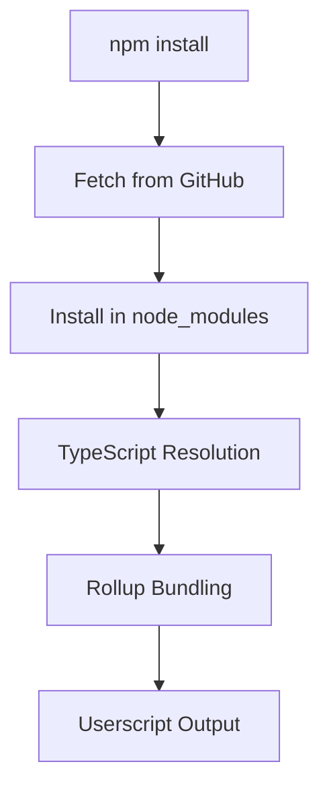

# Design Document

## Overview

This design outlines the integration of the DirNav module from the external GitHub repository (https://github.com/wondermike221/DirNav) into the userscripts project as an npm dependency without publishing to the public registry. The solution uses npm's built-in support for Git repositories as dependencies, ensuring seamless integration with the existing TypeScript and Rollup build system.

## Architecture

### Dependency Management Strategy

The integration will use npm's Git dependency feature, which allows installing packages directly from GitHub repositories using the format:
```
"dirnav": "git+https://github.com/wondermike221/DirNav.git"
```

This approach provides:
- Direct access to the latest repository code
- Automatic dependency resolution
- Standard npm module behavior
- Version pinning capabilities using Git tags or commit hashes

### Module Resolution Flow



### Integration Points

1. **Package.json Configuration**: Add Git dependency reference
2. **TypeScript Integration**: Ensure proper module resolution and type definitions
3. **Build System Integration**: Configure Rollup to handle the new dependency
4. **Code Migration**: Update existing imports and remove minimal implementation

## Components and Interfaces

### Package Configuration Component

**Location**: `package.json`
**Purpose**: Define the DirNav dependency using Git URL
**Configuration**:
```json
{
  "dependencies": {
    "dirnav": "git+https://github.com/wondermike221/DirNav.git#main"
  }
}
```

### TypeScript Integration Component

**Location**: `tsconfig.json` and type declarations
**Purpose**: Ensure proper module resolution and type safety
**Requirements**:
- Module resolution set to "node" (already configured)
- Type definitions from DirNav repository
- Import path resolution for "dirnav" module

### Build System Component

**Location**: `rollup.config.mjs`
**Purpose**: Bundle DirNav with userscripts
**Configuration Strategy**:
- Include DirNav in the bundle (not external)
- Handle any CSS or asset dependencies
- Ensure proper tree-shaking and optimization

### Code Migration Component

**Purpose**: Replace existing minimal DirNav implementation
**Scope**:
- Update import statements to use "dirnav" module
- Remove or refactor existing DirNav code
- Update any API calls to match new implementation

## Data Models

### Dependency Configuration Model

```typescript
interface GitDependency {
  name: string;           // "dirnav"
  url: string;           // Git repository URL
  ref?: string;          // Branch, tag, or commit hash
  version?: string;      // Semantic version if tagged
}
```

### Module Import Model

```typescript
// Expected import patterns
import DirNav from 'dirnav';
import { NavigationHelper, DirectoryTree } from 'dirnav';
```

### Build Configuration Model

```typescript
interface RollupDirNavConfig {
  external: string[];     // External dependencies (DirNav not included)
  plugins: Plugin[];      // Rollup plugins for processing
  output: {
    format: 'iife';       // Userscript format
    globals: Record<string, string>; // Global variable mappings
  };
}
```

## Error Handling

### Git Repository Access Errors

**Scenario**: GitHub repository is inaccessible or private
**Handling**:
- Verify repository URL and access permissions
- Provide clear error messages during npm install
- Document authentication requirements if repository becomes private

### Type Definition Errors

**Scenario**: DirNav module lacks TypeScript definitions
**Handling**:
- Create local type declarations in `src/types/dirnav.d.ts`
- Use module augmentation if needed
- Implement gradual typing approach

### Build Integration Errors

**Scenario**: Rollup cannot resolve or bundle DirNav
**Handling**:
- Configure proper module resolution in Rollup
- Handle CSS and asset imports appropriately
- Implement fallback bundling strategies

### Version Compatibility Errors

**Scenario**: DirNav API changes break existing code
**Handling**:
- Pin to specific Git commit or tag
- Implement adapter pattern for API differences
- Gradual migration strategy for breaking changes

## Testing Strategy

### Dependency Installation Testing

**Objective**: Verify Git dependency installation works correctly
**Approach**:
- Test `npm install` with clean node_modules
- Verify DirNav appears in node_modules
- Check dependency resolution in package-lock.json

### TypeScript Compilation Testing

**Objective**: Ensure TypeScript can resolve and compile DirNav imports
**Approach**:
- Test import statements compile without errors
- Verify type checking works correctly
- Test IntelliSense and autocomplete functionality

### Build System Testing

**Objective**: Confirm Rollup successfully bundles DirNav
**Approach**:
- Test development build (`npm run dev`)
- Test production build (`npm run build`)
- Verify DirNav functionality in generated userscripts

### Integration Testing

**Objective**: Validate DirNav works in ServiceNow environment
**Approach**:
- Test userscripts with DirNav in browser
- Verify navigation functionality works as expected
- Test compatibility with existing userscript features

### Regression Testing

**Objective**: Ensure existing functionality remains intact
**Approach**:
- Test all existing userscripts still function
- Verify build process performance
- Check for any breaking changes in workflow

## Implementation Considerations

### Version Management

- Use Git tags for stable releases: `"dirnav": "git+https://github.com/wondermike221/DirNav.git#v1.0.0"`
- Pin to specific commits for stability: `"dirnav": "git+https://github.com/wondermike221/DirNav.git#abc1234"`
- Use branch references for development: `"dirnav": "git+https://github.com/wondermike221/DirNav.git#main"`

### Performance Optimization

- Ensure tree-shaking works with DirNav exports
- Minimize bundle size impact
- Optimize for userscript loading performance

### Development Workflow

- Support hot reloading during development
- Maintain fast build times
- Ensure proper source map generation for debugging

### Security Considerations

- Verify repository authenticity and integrity
- Consider using SSH URLs for private repositories
- Implement dependency scanning for security vulnerabilities